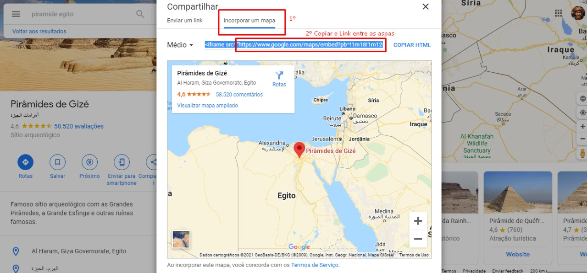

# CompiladorMonstrão


## Integrantes
- [Daniel Farah, 417513](https://github.com/danielfarah54)
- [Matheus Yassuo, 746040](https://github.com/yasuo-00)
- [Mayk Bezerra, 727953](https://github.com/mayktu)


## Trabalho 1 - Análise Léxica
O trabalho 1 (T1) da disciplina consiste em implementar um analisador léxico para a [linguagem LA](https://github.com/yasuo-00/compiladorMonstrao/blob/main/Gramatica_LA.pdf)
(Linguagem Algorítmica) desenvolvida pelo prof. Jander, no âmbito do DC/UFSCar. O analisador
léxico deve ler um programa-fonte e produzir uma lista de tokens identificados.

### Dependências:

* ATLR4
* MAVEN
* JDK > 1.8


### Como compilar o Análisador Léxica (Pasta raiz do projeto):

```
$ mvn compile
```


### Como executar (Pasta raiz do projeto):

[Executável](https://github.com/yasuo-00/compiladorMonstrao/blob/main/T1/target/CompiladorAlguma-1.0-SNAPSHOT-jar-with-dependencies.jar)

```
$ java -jar ./target/CompiladorAlguma-1.0-SNAPSHOT-jar-with-dependencies.jar ArquivoDeEntrada ArquivoDeSaida
```

## Trabalho 2 - Análise Sintática
O trabalho 2 (T2) da disciplina consiste em implementar um analisador sintático para a [linguagem LA](https://github.com/yasuo-00/compiladorMonstrao/blob/main/Gramatica_LA.pdf)
(Linguagem Algorítmica) desenvolvida pelo prof. Jander, no âmbito do DC/UFSCar. O analisador
sintático deve ler um programa-fonte e apontar onde existe erro sintático, indicando a linha e o
lexema que causou a detecção do erro.

### Dependências:

* ATLR4
* MAVEN
* JDK > 1.8


### Como compilar o Análisador Léxica (Pasta raiz do projeto):

```
$ mvn compile
```


### Como executar (Pasta raiz do projeto):

[Executável](https://github.com/yasuo-00/compiladorMonstrao/blob/main/T2/target/CompiladorAlguma-1.0-SNAPSHOT-jar-with-dependencies.jar)

```
$ java -jar ./target/CompiladorAlguma-1.0-SNAPSHOT-jar-with-dependencies.jar ArquivoDeEntrada ArquivoDeSaida
```


## Trabalho 3 - Análise Semantica e Gerador de Codigos
O trabalho 3 (T3) da disciplina consiste em implementar um analisador semântico e um gerador de
código para a linguagem LA (Linguagem Algorítmica) desenvolvida pelo prof. Jander, no âmbito do
DC/UFSCar.

O analisador semântico deve detectar 6 tipos de erros:
1. Identificador (variável, constante, procedimento, função, tipo) já declarado anteriormente no
escopo
2. Tipo não declarado
3. Identificador (variável, constante, procedimento, função) não declarado
4. Incompatibilidade entre argumentos e parâmetros formais (número, ordem e tipo) na
5. Atribuição não compatível com o tipo declarado
6. Uso do comando 'retorne' em um escopo não permitido

O gerador de código deverá produzir código executável em C equivalente ao programa de entrada.

### Dependências:

* ATLR4
* MAVEN
* JDK > 1.8


### Como compilar o Análisador Léxica (Pasta raiz do projeto):

```
$ mvn compile
```


### Como executar (Pasta raiz do projeto):

[Executável](https://github.com/yasuo-00/compiladorMonstrao/blob/main/T3/target/CompiladorAlguma-1.0-SNAPSHOT-jar-with-dependencies.jar)

```
$ java -jar ./target/CompiladorAlguma-1.0-SNAPSHOT-jar-with-dependencies.jar ArquivoDeEntrada ArquivoDeSaida
```

### Para executar o corretor automatico do professor Lucredio

```
java -jar corretor-automatico.jar  "java -jar compilador_jar_semantico.jar" gcc caminho_resultado_casos caminho_absoluto_casos_de_teste "746040,727953,417513" semantico
```


## Trabalho 4 - Compilador Completo de Linguagem para Geração de Cronogramas
O trabalho 4 (T4) da disciplina consiste em implementar um compilador completo para uma
linguagem de sua escolha. Não é necessário implementar uma linguagem de programação completa
(como LA, ou Alguma). Na verdade, isso não é recomendável, dado que irá tomar muito tempo. A
ideia é criar uma linguagem pequena, de preferência declarativa, para alguma aplicação específica
de interesse dos estudantes. O único requisito é que o compilador tenha:

- Análise léxica + sintática: em outras palavras, uma gramática;
- Análise semântica: três ou quatro (ou mais) verificações de conformidade que não são feitas pela gramática;
- Geração de código ou interpretação: algo de útil ou interessante feito com a linguagem.

### Descrição do nosso CompiladorTask

O CompiladorTask tem como objetivo gerar uma pagina HTML com as task da pessoa, ordenadas de acordo a proximidade do evento, categorizadas e ter uma visibilidade mais facil em um site.

### Definição da gramática

- [Gramática CronogramaTask](https://github.com/yasuo-00/compiladorMonstrao/blob/main/T4/grammar.pdf)

### Link do Video
- [Link do Video privado no Youtube](https://youtu.be/lXLfi3GZEdw)

### Localidade dos Casos de Uso
- Os casos de uso se encontram na pasta raiz em uma pasta chamada "casos_de_teste".

### Como extrair uma localidade para colocar em um caso de uso

1. Para alimentar um caso de uso com a localidade extraimos do Google Maps a localidade, clicando em compartilhar:
<p align="center">

</p>

<br>

2. Logo apos abrir o compartilhar clique em Incorporar um Mapa e copie o link dentro das aspas de "src":
<p align="center">

</p>


### Dependências:

* ATLR4
* MAVEN
* JDK > 1.8


### Como compilar o Compilador (Pasta raiz do projeto):

```
$ mvn compile
```


### Como executar Analisador Lexico e Sintatico, Analisador Semantico, Gerador de codigo:

[Executável](https://github.com/yasuo-00/compiladorMonstrao/blob/main/T4/target/CompiladorTask-1.0-SNAPSHOT-jar-with-dependencies.jar)

```
$ java -jar ./target/CompiladorTask-1.0-SNAPSHOT-jar-with-dependencies.jar ArquivoDeEntrada DiretorioDeSaida
```

### Saída
O programa gerará um arquivo "index.html"  
Para abrir o arquivo gerado na formatação ideal, subtituí-lo na pasta T4/page_files


