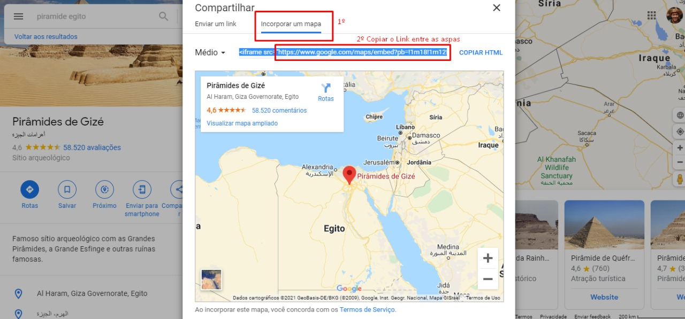

## Trabalho 4 - Compilador Completo de Linguagem para Geração de Cronogramas
O trabalho 4 (T4) da disciplina consiste em implementar um compilador completo para uma
linguagem de sua escolha. Não é necessário implementar uma linguagem de programação completa
(como LA, ou Alguma). Na verdade, isso não é recomendável, dado que irá tomar muito tempo. A
ideia é criar uma linguagem pequena, de preferência declarativa, para alguma aplicação específica
de interesse dos estudantes. O único requisito é que o compilador tenha:

- Análise léxica + sintática: em outras palavras, uma gramática;
- Análise semântica: três ou quatro (ou mais) verificações de conformidade que não são feitas pela gramática;
- Geração de código ou interpretação: algo de útil ou interessante feito com a linguagem.

### Descrição do nosso CompiladorTask

O CompiladorTask tem como objetivo gerar uma pagina HTML com as task da pessoa, ordenadas de acordo a proximidade do evento, categorizadas e ter uma visibilidade mais facil em um site.

### Definição da gramática

- [Gramática CronogramaTask](https://github.com/yasuo-00/compiladorMonstrao/blob/main/T4/grammar.pdf)

### Link do Video
- [Link do Video privado no Youtube](https://youtu.be/lXLfi3GZEdw)

### Localidade dos Casos de Uso
- Os casos de uso se encontram na pasta raiz em uma pasta chamada "casos_de_teste".

### Como extrair uma localidade para colocar em um caso de uso

1. Para alimentar um caso de uso com a localidade extraimos do Google Maps a localidade, clicando em compartilhar:
<p align="center">

</p>

<br>

2. Logo apos abrir o compartilhar clique em Incorporar um Mapa e copie o link dentro das aspas de "src":
<p align="center">

</p>


### Dependências:

* ATLR4
* MAVEN
* JDK > 1.8


### Como compilar o Compilador (Pasta raiz do projeto):

```
$ mvn compile
```


### Como executar Analisador Lexico e Sintatico, Analisador Semantico, Gerador de codigo:

[Executável](https://github.com/yasuo-00/compiladorMonstrao/blob/main/T4/target/CompiladorTask-1.0-SNAPSHOT-jar-with-dependencies.jar)

```
$ java -jar ./target/CompiladorTask-1.0-SNAPSHOT-jar-with-dependencies.jar ArquivoDeEntrada
```

### Saída

Abrir index.html na pasta /page_files


